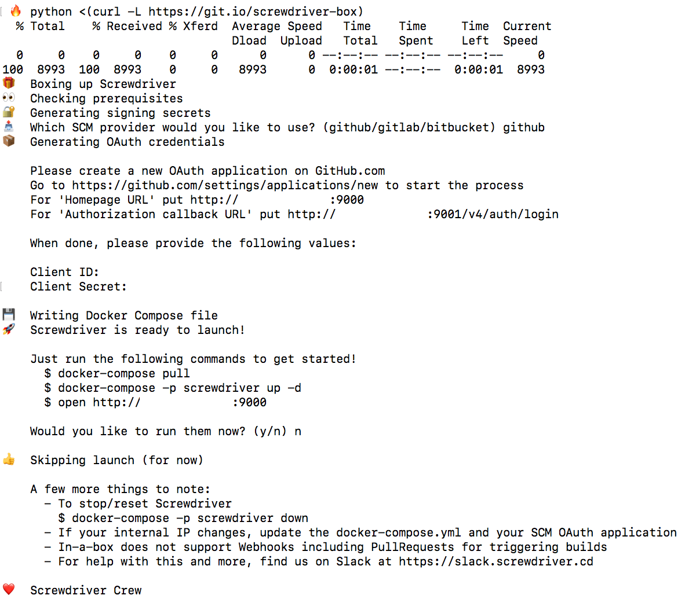
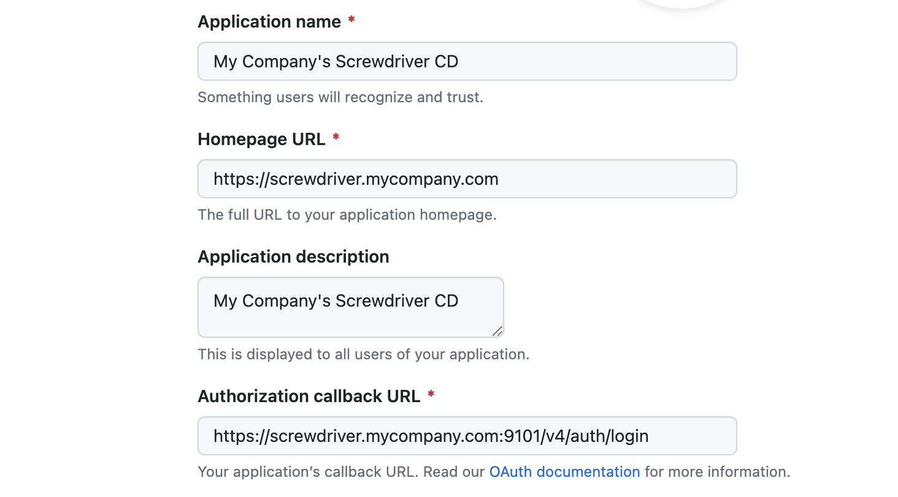

## Docker Compose

We can run Screwdriver locally via Docker Compose. This handy feature will bring up an entire Screwdriver instance (UI,
API, and log store) locally for you to play with.

Follow instructions in the [Docker Compose Quickstart].



## Running Docker Compose in AWS EC2 (Production Deployment)

We can extend our [local Screwdriver](#docker-compose) to support running it in production using Docker Compose, too.
Let's assume we would like to deploy Screwdriver to a server with a SSL-enabled domain called
`https://screwdriver.mycompany.com`, what we will need to do is the following:

1. Spin up an EC2 with size at least __large__
2. SSH into the EC2 to [Install Docker](https://github.com/QubitPi/docker-install) and
   [set up Nginx and SSL](https://hashicorp-aws.com/docs/setup#optional-setup-ssl)
3. Complete the [Docker Compose Quickstart] to get a working `docker-compose.yml` file along with its
   [local.yaml](https://github.com/QubitPi/screwdriver-cd-local/blob/master/local.yaml) unchanged

Next, let's configure the domain `https://screwdriver.mycompany.com`, which is discussed in the following section:

### Configuring Screwdriver with a Custom Domain

Modify the `docker-compose.yml`:

- Replace all `http://${auto-generated-private-ip}:9000` with `https://screwdriver.mycompany.com`, where
  `${auto-generated-private-ip}` is the private IP address of the EC2 instance
- Replace all `http://${auto-generated-private-ip}:9001` with `https://screwdriver.mycompany.com:9101`
- Replace all `http://${auto-generated-private-ip}:9001` with `https://screwdriver.mycompany.com:9102`
- Add a new config of `OAUTH_REDIRECT_URI: https://screwdriver.mycompany.com:9101` to the `environment` section of the
  `api` service. For example:

  ```yaml
  version: '2'
  services:
    api:
      ...
      environment:
        PORT: 80
        URI: https://screwdriver.mycompany.com:9101
        ECOSYSTEM_UI: https://screwdriver.mycompany.com
        ECOSYSTEM_STORE: https://screwdriver.mycompany.com:9102
        OAUTH_REDIRECT_URI: https://screwdriver.mycompany.com:9101
  ```

  This is because Screwdriver, in this case, computes redirect URL as non-9101 port URL of
  `https://screwdriver.mycompany.com:9001`, which will cause
  ["Redirect URI mismatch" OAuth error during sign-in phase later](https://docs.github.com/en/apps/oauth-apps/maintaining-oauth-apps/troubleshooting-authorization-request-errors#redirect-uri-mismatch)

- In the `api` service environment variable list as well, set `AUTH_CHECK_BY_ID: "true"`, `SECRET_SD_ADMINS`, and
  `SECRET_ALLOW_LIST` as the following:

  ```yaml
  AUTH_CHECK_BY_ID: "true"
  SECRET_SD_ADMINS: |
    [
      "github:adminGitHubUserName:adminGitHubUserId"
    ]
  SECRET_ALLOW_LIST: |
    [
      "github:adminGitHubUserName:adminGitHubUserId",
      "github:orgMember1GitHubUserName:orgMember1GitHubUserId",
      "github:orgMember2GitHubUserName:orgMember2GitHubUserId",
      ...
    ]
  ```

  where `*GitHubUserId` can be [obtained using GitHub API](https://stackoverflow.com/a/17309026). These 3 configs makes
  sure that only the specified user can sign-in to see all dashboard pipelines

  More infor about these 3 configs can be found at
  [Authentication/Authorization docs](https://screwdriver-docs.qubitpi.org/cluster-management/configure-api#authentication--authorization)

[Set up the SSL certificate](https://hashicorp-aws.com/docs/setup#installing-free-ssl-certificates-with-certbot-running-on-nginx)
on the server with the following Nginx reverse proxy configs:

  - Port forwarding 443 to `localhost:9000`
  - Port forwarding 9101 to `localhost:9001`
  - Port forwarding 9102 to `localhost:9002`

Note that our HTTP**S** ports are 443/9101/9202. We don't have Nginx listen on 9001 or 9002 because Nginx cannot
occupy 9001 and 9002 due to the two already been taken by Screwdriver

The GitHub OAuth app should have configuration that looks like



### Configuring SCM User

```yaml
version: '2'
services:
  api:
    image: jack20191124/screwdriver:latest
    environment:
      SCM_SETTINGS: |
        {
            "github": {
                "plugin": "github",
                "config": {
                  "username": "my-scm-user",
                  "email": "my-scm-user@my-company.com",
                  "secret": "<my-random-secrets-sderegw3rfe>",
                  "privateRepo": true,
                  "oauthClientId": "<generated-with-local-screwdriver>",
                  "oauthClientSecret": "<generated-with-local-screwdriver>"
                }
            }
        }
```

__Make sure to add `my-scm-user@my-company.com` to GitHub account/organization's member list for it to obtain proper
permissions__


### Spin Up Screwdriver

Pull the required runtime images first:

```console
docker pull screwdrivercd/launcher
```

Then start Screwdriver with:

```console
nohup docker compose -p screwdriver up &
```

### Managing Screwdriver Instance

#### Periodically Deleting Dangling Docker objects [using cron](https://askubuntu.com/a/2369)

The Docker Compose doesn't handle the cleanup finished executor containers. If a Screwdriver pipeline run finishes and 
its executor container is left there, EC2 will quickly run out of disk space. To deal with this potential problem, we
can have a script like:

```bash
#!/bin/bash

while true; do
  docker container prune -f
  docker volume prune -f
  sleep 30
done
```

This script can run by `nohup ./cleanup.sh &`. Note that this script example cleans up all dangling containers every
_30_ seconds

## Configuring SD-in-a-Box Manually

_Note: This section does not need to be followed if the two sections above are done._

SD-in-a-box was intended to be an easy way to run a Screwdriver cluster locally on your development machine so you can demo its features first-hand.

### Custom Docker Images

Since it's powered by Docker, you can determine which images to use for it. SD-in-a-Box (and Screwdriver as a whole) uses the following Docker images:

* [screwdrivercd/screwdriver](https://hub.docker.com/r/screwdrivercd/screwdriver) - API. The main engine of the CI/CD cluster.
* [screwdrivercd/ui](https://hub.docker.com/r/screwdrivercd/ui) - UI. To pleasantly interact with Screwdriver.
* [screwdrivercd/store](https://hub.docker.com/r/screwdrivercd/store) - Artifact repository. Responsible for artifacts like build logs & templates
* [screwdrivercd/launcher](https://hub.docker.com/r/screwdrivercd/launcher/tags/) - Worker component that executes the build. You *cannot* change the image. You can only specify a specific tag to use.

Here is a snippet of the `docker-compose.yml` file

```
version: '2'
services:
  api:
    image: screwdrivercd/screwdriver:stable
    . . .
  ui:
    image: screwdrivercd/ui:stable
    . . .
  store:
    image: screwdrivercd/store:stable
    . . .
```

You can make a local Docker image to use instead of one of these.

To start up the SD-in-a-Box, execute the following command

```bash
$ docker-compose -p screwdriver up
```

### Volume-Mounted Source Code

You can choose to replace a component with a local copy. This is incredibly helpful if you're trying to implement an update to a service and want to see how it impacts the entire cluster.

Modify the `docker-compose.yaml`, targeting the component you would like to replace. In the following snippet, we replace the API with a local source.

```yaml
services:
  api:
    # this "build" stanza replaces the default "image" setting
    build:
      context: ./relative/path/to/api_source
      dockerfile: Dockerfile.local
  ui:
    . . .
  store:
    . . .
```

To set your update, you'll need to rebuild the docker-compose services first.

```bash
$ docker-compose build --no-cache
```

Restart the local cluster to have your changes take effect.

```bash
$ docker-compose -p screwdriver down
$ docker-compose -p screwdriver up
```

#### Caveats

This approach does very well with replacing complete services, and also carries some limitations:

* Unable to replace individual modules with this methodology.

### Local Development Instances

If you plan on making adjustments to a specific Screwdriver component, you can choose to replace a component with your development instance. This will give you a good idea on how it affects the other Screwdriver components before submitting it via Pull Request.

#### General configuration

One important thing to note is that your `docker-compose.yml` will have all the components configured by I.P. address (as opposed to `localhost`). The following features will cease to work if you choose to use `localhost` instead of an I.P. address:

* Builds will not start locally

#### Configuring the UI

You can choose to use a local development instance of the UI.

In development mode, the UI hosts itself on port `4200` and assumes the API is served locally on `8080` by default. You would need to modify the UI's `config/environment.js` file to point to your local Screwdriver cluster, specifically the API. This can be done by modifying `SDAPI_HOSTNAME` and `SDSTORE_HOSTNAME` values to match the services -> api -> environment -> `URI` and `ECOSYSTEM_STORE` in your `docker-compose.yml`.

The following is a snippet that highlights the change you would make in the `config/environment.js`

```js
 ...
 APP: {
       // Here you can pass flags/options to your application instance
       // when it is created
       SDAPI_HOSTNAME: 'http://172.142.26.99:9001',
       SDAPI_NAMESPACE: 'v4',
       SDSTORE_HOSTNAME: 'http://172.142.26.99:9002',
       ...
     },
```

The following snippet highlights the `docker-compose.yml` values that need to be modified to use your local UI instance along with the SD-in-a-box cluster. You will also need to delete the `ui` section under `services`.

```yaml
version: '2'
services:
    api:
        image: screwdrivercd/screwdriver:stable
        ports:
            - 9001:80
        volumes:
            - /var/run/docker.sock:/var/run/docker.sock:rw
            - ./data/:/tmp/sd-data/:rw
        environment:
            PORT: 80
            URI: http://172.142.26.99:9001 # API
            ECOSYSTEM_UI: http://localhost:4200 # need to change to this value here
            ECOSYSTEM_STORE: http://172.142.26.99:9002 # Store
    . . .
    store:
        image: screwdrivercd/store:stable
        ports:
            - 9002:80
        environment:
            ECOSYSTEM_UI: http://localhost:4200
            URI: http://172.142.26.99:9002
```

Please note that you cannot use `localhost` for the `ECOSYSTEM_UI` value if the `URI` value is set to an I.P. address. You will receive an invalid token after log-in.

Once you've made these changes, follow instructions in the UI [README.md](https://github.com/screwdriver-cd/ui/#screwdriver-ui) to get it running on http://localhost:4200.

Rerun the commands to restart SD-in-a-box with the new changes:

```bash
$ docker-compose -p screwdriver up
$ docker-compose build --no-cache
$ docker-compose -p screwdriver up
```

_Note: Using Chrome will cause login issues. Please use a different browser._

#### Configuring the API

You can choose to use a local development instance of the API.

Further customization can be done by setting the related environment variables. Learn more in [the API documentation](https://github.com/screwdriver-cd/screwdriver#environment)


#### Configuring the Store

You can choose to use a localhost development instance of the Store.

In development mode, the Store hosts itself on port `80` by default. You may change this value to whichever port you desire. For the purposes of this guide, we will assume it's hosted on `8888`.

The following snippet highlights the `docker-compose.yml` values that need to be modified to use your local store instance along with the SD-in-a-box cluster.

```yaml
version: '2'
services:
  store:
    . . .
    ports:
      - 8888:80    # Port 8888 is arbitrary. You can choose another if you prefer
    environment:
      URI: http://11.22.33.44:9001
      ECOSYSTEM_STORE: http://10.73.202.183:8888    # Tells the API where the store is hosted
    . . .
```

[Docker Compose Quickstart]: https://github.com/QubitPi/screwdriver-cd-local
