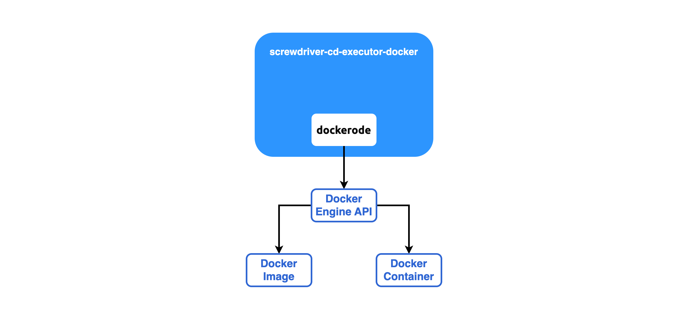

Docker Executor
===============

To develop [screwdriver-cd-executor-docker], one should first be familiar with [Docker Engine API] and [dockerode]. The
relationship between the 3 is illustrated in the diagram below:



At the end of day, [screwdriver-cd-executor-docker] creates Docker image and container for Screwdriver via
[Docker Engine API], but it does not interact with the API directly, but through a 3rd party library called
[dockerode].

To learn [dockerode], going through its [README](https://github.com/apocas/dockerode?#usage) and
[examples](https://github.com/apocas/dockerode/tree/master/examples) shall be enough

/var/run/docker.sock
--------------------

Screwdriver, as a Continuous Delivery tool, is often used to run software tests, such as integration tests, in
[screwdriver-cd-executor-docker]. Docker Compose nowadays is frequently used in complicated testing scenarios. To
support run Docker Compose in [screwdriver-cd-executor-docker], we shall install Docker, run container, or run Docker 
Compose in [screwdriver-cd-executor-docker]. For example

```yaml
jobs:
  main:
    requires: [~pr, ~commit]
    image: buildpack-deps:22.04-scm
    steps:
      - install-docker: curl -fsSL https://get.docker.com -o get-docker.sh && sh get-docker.sh
      - spin-up-webservice: docker compose up
```

It is very important, from a developer's perspective, to understand what's happening behind scene. Specifically, having
a solid understanding of
[/var/run/docker.sock](https://qubitpi.github.io/docker-docs/engine/reference/commandline/dockerd/#daemon-socket-option)
is crucial.

The `/var/run/docker.sock` is integrated into [screwdriver-cd-executor-docker] via this [Docker Engine API] instruction 
in [index.js](https://github.com/QubitPi/screwdriver-cd-executor-docker/blob/master/index.js):

```javascript
HostConfig: {
    Privileged: true,
    Binds: ['/var/run/docker.sock:/var/run/docker.sock']
}
```

Without it, running Docker container or Docker compose in [screwdriver-cd-executor-docker] will generate the following
error:

```bash
Cannot connect to the Docker daemon at unix:///var/run/docker.sock. Is the docker daemon running?
```

[Docker Engine API]: https://docs.docker.com/engine/api/
[dockerode]: https://github.com/apocas/dockerode

[screwdriver-cd-executor-docker]: https://github.com/QubitPi/screwdriver-cd-executor-docker
