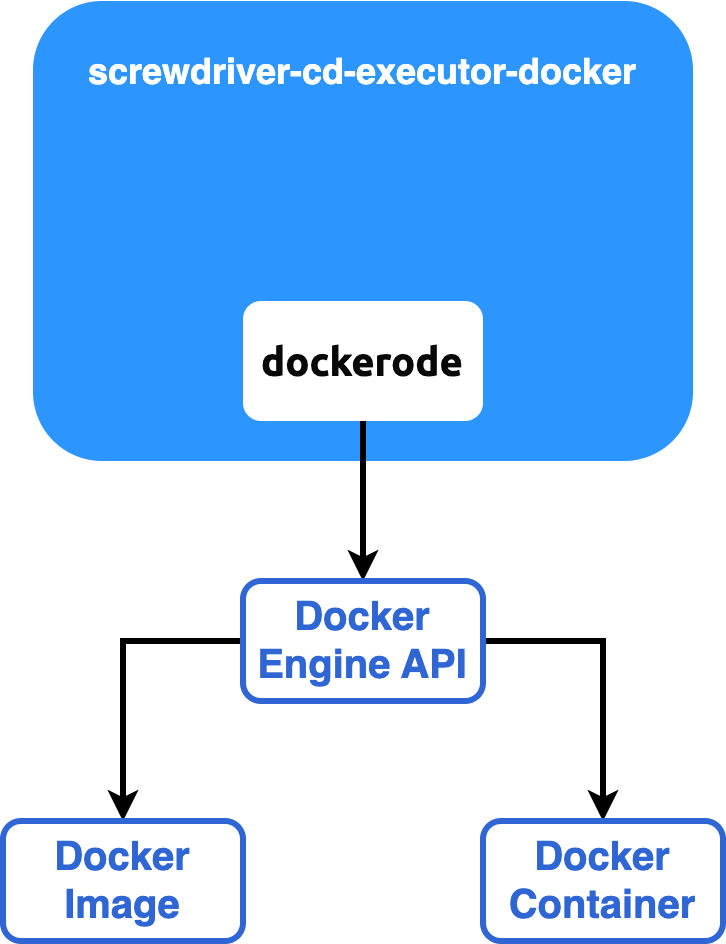

Docker Executor
===============

To develop [screwdriver-cd-executor-docker], one should first be familiar with [Docker Engine API] and [dockerode]. The
relationship between the 3 is illustrated in the diagram below:



At the end of day, [screwdriver-cd-executor-docker] creates Docker image and container for Screwdriver via
[Docker Engine API], but it does not interact with the API directly, but through a 3rd party library called
[dockerode].

To learn [dockerode], going through its [README](https://github.com/apocas/dockerode?#usage) and
[examples](https://github.com/apocas/dockerode/tree/master/examples) shall be enough

/var/run/docker.sock
--------------------

Screwdriver, as a Continuous Delivery tool, is often used to run software tests, such as integration tests, in
[screwdriver-cd-executor-docker]. Docker Compose nowadays is frequently used in complicated testing scenarios. To
support run Docker Compose in [screwdriver-cd-executor-docker], we shall install Docker, run container, or run Docker 
Compose in [screwdriver-cd-executor-docker]. For example

```yaml
jobs:
  main:
    requires: [~pr, ~commit]
    image: buildpack-deps:22.04-scm
    steps:
      - install-docker: curl -fsSL https://get.docker.com -o get-docker.sh && sh get-docker.sh
      - spin-up-webservice: docker compose up
```

It is very important, from a developer's perspective, to understand what's happening behind scene. To start off, we
need to talk about [/var/run/docker.sock](#what-is-varrundockersock)

#### What is /var/run/docker.sock?

`/var/run/docker.sock` is the default Unix socket. Sockets are meant for communication between processes on the same
host.


Docker daemon by default listens to **docker.sock**. If we are on the same host where the Docker daemon is running, we
can use the `/var/run/docker.sock` to manage containers, which means we can mount the Docker socket from the host into
the container.

For example, if we run the following command, it will return the version of the docker engine.

```bash
curl --unix-socket /var/run/docker.sock http://localhost/version
```

To run docker inside docker, we run docker with the default Unix socket `docker.sock` as a volume.

For example

```bash
docker run -v /var/run/docker.sock:/var/run/docker.sock -it docker
```

Now, from within the container, we should be able to execute docker commands for building and pushing images to the
registry. _This looks like Docker-in-Docker, feels like Docker-in-Docker, but it's not Docker-in-Docker._ When this 
container will create more containers, those containers will be created in the top-level Docker. We will not experience 
nesting side effects, and the build cache will be shared across multiple invocations. Those containers are not "child" 
containers, but more accurately "sibling" containers. The actual docker operations happen on the VM host running our 
base docker container rather than from within the container. Meaning, even though we are executing the docker commands 
from within the container, we are instructing the docker client to connect to the VM host docker-engine through 
`docker.sock`

**Just a word of caution**: If a container gets access to `docker.sock`, it means it has more privileges over docker
daemon. So when used in real projects, understand the security risks, and use it.

#### Socket Solution

The `docker.sock` mentioned above is integrated into [screwdriver-cd-executor-docker] via this [Docker Engine API]
instruction in [index.js]():

```javascript
HostConfig: {
    Privileged: true,
    Binds: ['/var/run/docker.sock:/var/run/docker.sock']
}
```

Without it, running Docker container or Docker compose in [screwdriver-cd-executor-docker] will generate the following
error:

```bash
Cannot connect to the Docker daemon at unix:///var/run/docker.sock. Is the docker daemon running?
```

[Docker Engine API]: https://docs.docker.com/engine/api/
[dockerode]: https://github.com/apocas/dockerode

[screwdriver-cd-executor-docker]: https://github.com/QubitPi/screwdriver-cd-executor-docker


