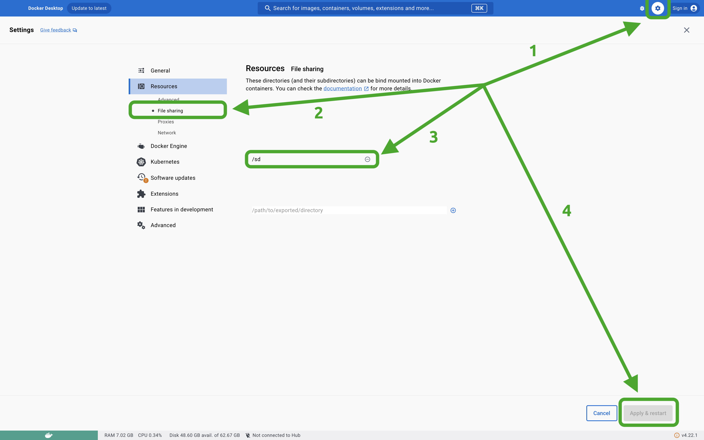

Docker Executor
===============

> This guide is written for developers who would **use** [screwdriver-cd-executor-docker] in Continuous Delivery. If you
> are interested in contributing to [screwdriver-cd-executor-docker], please read our
  [internal documentations](../contributing/components/executor-docker) to get familiarized with relevant technologies.

[screwdriver-cd-executor-docker] is an executor for Screwdriver CD that interacts with Docker (local and remote). All of
our [screwdriver steps] are executed by it in a Docker container. The executor controls Docker Engine via [dockerode]. 
[dockerode] is a node.js way of interacting with [Docker Engine API].

Use Docker Executor
-------------------

To enable Docker executor, the [Screwdriver config file] should have the follwoing minimum configuration:

```yaml
executor:
  plugin: docker
  docker:
    enabled: true
    options:
      docker: {}
      launchVersion: stable
```

If [Screwdriver config file] is beyond control, one can also set the following environment variables to turn on Docker
executor:

```bash
export EXECUTOR_PLUGIN=docker
```

Troubleshooting
---------------

### File Sharing

```bash
Error response from daemon: Mounts denied:
The path /sd/workspace/src/github.com/.../datafile.txt is not shared from the host and is not known 
to Docker.
You can configure shared paths from Docker -> Preferences... -> Resources -> File Sharing.
```

The `datafile.txt` is using a ["bind mount"](https://stackoverflow.com/a/40005871). This means the /sd/workspace/...
must be an _existing_ and _shared_ directory on the host machine

If the host machine runs Docker Desktop, simply add **/sd** to the file sharing config in Docker Desktop:



### ERROR: Can't initialize batch_readline - may be the input source is a directory or a block device.

This usually happens when we are running MySQL Docker or Docker Compose containing MySQL service inside Docker executor.
For example:

```yaml
version: "3.9"
services:
  db:
    image: "mysql:5.7.43"
    ports:
      - "3306:3306"
    volumes:
      - ./mysql-init.sql:/docker-entrypoint-initdb.d/mysql-init.sql
```

We are sure `mysql-init.sql` is a file, but when we are executing it in MySQL docker generates the error above. The 
underlying reason causing the file being shared with -v to appear as a directory instead of a file is that _Docker
could not find the file on the host because it is running Docker-in-Docker_. Being a Docker container path, `.
/mysql-init.sql` should be changed to the path on the host machine.

[Docker Engine API]: https://docs.docker.com/engine/api/
[dockerode]: https://github.com/apocas/dockerode

[screwdriver-cd-executor-docker]: https://github.com/QubitPi/screwdriver-cd-executor-docker
[screwdriver steps]: https://screwdriver-docs.netlify.app/user-guide/quickstart#steps
[Screwdriver config file]: https://github.com/QubitPi/screwdriver-cd-screwdriver/blob/master/config/default.yaml
