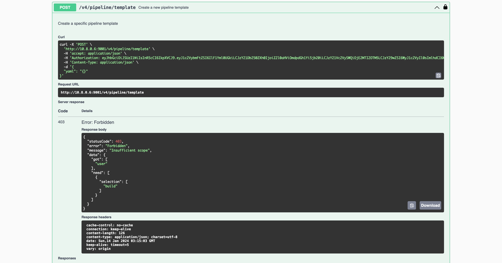

Job Templates
=============

Templates are snippets of predefined code that people can use to replace a job definition in a
[screwdriver.yaml](../configuration). A template contains a series of predefined steps along with a selected Docker
image.

Finding Templates
-----------------

To figure out which templates already exist, we can make a `GET` call to the `/templates` [API](../api) endpoint. We can
also browse templates in the UI at `<YOUR_UI_URL>/templates`.

Example templates page:


Using a Template
----------------

To use a template, define a `screwdriver.yaml` with a `template` key. In this example, we are using the
[nodejs/test template](https://cd.screwdriver.cd/templates/nodejs/test).

Example `screwdriver.yaml`:

```yaml
jobs:
  main:
    requires: [~pr, ~commit]
    template: nodejs/test@1.0.4
```

Version is [semver](https://semver.org/) compatible. For example, we can refer the template above with `nodejs/test@1`
or `nodejs/test@1.0`

You can also refer to a template version with a tag name if the template has one. All the versions and tags of a
template are displayed at the bottom of a template's description, such as for
[the example template](https://cd.screwdriver.cd/templates/nodejs/test), which has the tags `latest` and `stable`.

Most templates will tag the most recent version as `latest`, and many templates use either automated testing or manual
curation to identify some version as `stable`. These are floating tags, so using them in a job means its
template-provided steps may suddenly change.

If no template version is specified, the most recently published will be used. This is usually synonymous with
specifying the `latest` tag. It is generally better to explicitly state a template version than to implictly use
`latest`.

The most reliable way to avoid unexpected template changes is to refer to a specific version of the template. For
instance, `nodejs/test@1.0.4` is an immutable reference to a particular list of steps. Using a reference such as
`nodejs/test@1.0` means that a job will automatically use `nodejs/test@1.0.5` when it becomes available, but that comes
with risk of an unexpected change in behavior.

### Version/Tag Semantics

Template versions can be referenced in a variety of ways that express users' trade-off between an unchanging set of
steps and automatically using improvements that a template's maintainers have added. As above, these examples reference
[nodejs/test template](https://cd.screwdriver.cd/templates/nodejs/test).

- `nodejs/test@latest` - this will use the most recently published version of the template, which may include
  backwards-incompatible changes, major version changes, etc. The `latest` tag should primarily be used by a template's
  maintainers and may be unsuitable for production or similarly important builds.
- `nodejs/test@stable` - this will use a version of the template that its maintainers have designated as sufficiently
  stable for general usage. It may represent a significant change in capability from older uses of the `stable` tag.
  Template maintainers should communicate to users when changes to the `stable` tag are not backwards compatible.
- `nodejs/test@1` - this will use the most recent version of `nodejs/test` that is less than 2.0.0. This is essentially
  the `latest` tag without crossing a major version boundary.
- `nodejs/test@1.0` - this will use the most recent version of `nodejs/test` than is less than 1.1.0. This is
  essentially the `latest` tag without crossing a minor version boundary.
- `nodejs/test@1.0.4` - this is the most predictable way to specify a pipeline's behavior and is not affected by future
  changes to the template.

#### Example

For this configuration:

```yaml
jobs:
  main:
    requires: [~pr, ~commit]
    template: nodejs/test@stable
```

Screwdriver takes the template configuration and plugs it in, so that the `screwdriver.yaml` becomes:

```yaml
jobs:
  main:
    image: node:lts
    requires: [~pr, ~commit]
    steps:
      - install: npm install
      - test: npm test
    environment:
      FOO: bar
    secrets:
      - NPM_TOKEN
```

### Overriding Template Steps

A job can override Template steps by [wrapping](#wrapping-steps) or [replacing](#replacing-steps) existing steps.

#### Wrapping Steps

Wrapping is when we add commands to run before and/or after an existing step. To wrap a step from a template, add a
`pre` or `post` in front of the step name. For Example:

```yaml
jobs:
  main:
    requires: [~pr, ~commit]
    template: nodejs/test@1.0.3
    steps:
      - preinstall: echo pre-install
      - postinstall: echo post-install
```

This will run the command `echo pre-install` before the template's `install` step, and `echo post-install` after the
template's `install` step.

#### Replacing Steps

To replace a step from a template, add our command with the same template's step name.

Example:
```yaml
jobs:
  main:
    requires: [~pr, ~commit]
    template: nodejs/test@1.0.3
    steps:
      - install: echo skip installing
```

This will run the command `echo skip installing` for the `install` step.

Note: We cannot replace a [locked step](#template-locked-steps).

We can also replace the image defined in the template. Some template steps might rely on commands or environment
invariants that our image may not have, so be careful with image replacement.

Example:
```yaml
jobs:
  main:
    requires: [~pr, ~commit]
    image: node:latest
    template: nodejs/test@1.0.3
```

### Merging with Shared Steps

When overriding Template steps, a job can get the step definitions from either `shared.steps` or `job.steps` with
precedence for `steps` defined in `job` section. This follows the same order of precedence for step definitions without
using a template. Users can change this behavior using [annotation](../configuration/annotations)
`screwdriver.cd/mergeSharedSteps: true`. When set to `true`, steps in `shared` and `job` sections are merged when a
Template is used.

For example

```yaml
shared:
  annotations:
    screwdriver.cd/mergeSharedSteps: true
  steps:
    - premotd: echo build
jobs:
main:
  template: python/package_rpm@latest
  requires: [~pr, ~commit]
  steps:
    - preinit_os: echo replace
```

The following example defines a merged shared configuration for `image` and `steps`, which is used by the `main` and
`main2` jobs.

```yaml
shared:
  image: node:lts
  template: nodejs/test
  steps:
    - init: npm install
    - pretest: npm lint
    - test: npm test

jobs:
  main:
    requires: [~pr, ~commit]
    image: node:lts
  main2:
    template: sd/noop@latest
    annotations:
      screwdriver.cd/mergeSharedSteps: true
    requires: [main]
    steps:
      - test: echo Skipping test
```

The above example would be equivalent to:

```yaml
jobs:
  main:
    requires: [~pr, ~commit]
    image: node:lts
    steps:
      - init: npm install
      - pretest: npm lint
      - test: npm test
  main2:
    template: sd/noop@latest
    annotations:
      screwdriver.cd/mergeSharedSteps: true
    requires: [main]
    image: node:lts
    steps:
      - init: npm install
      - pretest: npm lint
      - test: echo Skipping test
```

### Ordering

When using a template, we can pick up both steps defined by the template and by our own configuration with the `order`
field. This field is defined as an ordered array of step names. For example:

Let's say our template `sd-template.yaml` is:

```yaml
namespace: nodejs
name: publish
version: "2.0.1"
description: 'Publish an npm package'
maintainer: myname@foo.com
images:
  lts: node:lts
  latest: node:latest
config:
  image: stable
  steps:
    - install: npm install
    - publish: npm publish
    - coverage: coverage test.js
```

And our pipeline `screwdriver.yaml` is:

```yaml
jobs:
  main:
    requires: [~commit]
    image: stable
    template: nodejs/publish@2
    order: [clone, install, doesnotexist, test, publish, coverage]
    steps:
      - test: npm test
      - clone: git clone https://github.com/screwdriver-cd/toolbox.git ci
      - coverage: ./ci/coverage.sh
```

Using the template in the pipeline results in the following effective final pipeline:

```yaml
jobs:
  main:
    requires: [~commit]
    image: node:lts
    steps:
      - clone: git clone https://github.com/screwdriver-cd/toolbox.git ci
      - install: npm install
      - test: npm test
      - publish: npm publish
      - coverage: ./ci/coverage.sh  # This step was overwritten by the job
```

Caveats:

- `order` can only be used when `template` is used.
- Steps that cannot be found will be skipped.
- User-defined `teardown-` steps will always be run after the rest of the steps are done.
- Implicit wrapping of steps(pre/post) will not work with this field.
- The priority in determining duplicate step definitions goes like this: job > template
- When the annotation `screwdriver.cd/mergeSharedSteps: true`, priority will be: job > shared > template

Creating a Template
-------------------

### Writing a Template in YAML

To create a template, create a new repo with a `sd-template.yaml` file. The file should contain

- a namespace
- name
- version
- description
- maintainer email, and
- a config with an image and steps.

If no namespace is specified, a `default` namespace will be applied. An optional `images` keyword can be defined to
list supported images with a descriptive label. Basic example can be found in our
[screwdriver-cd-test/template-example repo](https://github.com/screwdriver-cd-test/template-example).

An example `sd-template.yaml` could be the following:

```yaml
namespace: myNamespace
name: template-name
version: '1.3'
description: template for testing
maintainer: foo@bar.com
images:
  stable-image: node:lts
  latest-image: node:latest
config:
  image: stable-image
  steps:
    - install: npm install
    - test: npm test
  environment:
    FOO: bar
  secrets:
    - NPM_TOKEN
```

#### Template images

We recommend using the `images` feature, which can be configured to list supported images with a descriptive label or
alias. For example:

```yaml
namespace: myNamespace
name: template_name
version: '1.3'
description: template for testing
maintainer: foo@bar.com
images:
  stable-image: node:lts
  latest-image: node:latest
```

Users can pick an alias from the list and use it like so:

```yaml
jobs:
  main:
    template: myNamespace/template_name@1.3.0
    image: stable-image
```

Example repo: <https://github.com/screwdriver-cd-test/template-images-example>

#### Template Steps

Please avoid [wrapping](#using-a-template) prefixes (`pre` or `post`) in template step names, as it can lead to
problems when users try to modify or enhance the steps. For example, if a template has these steps:

```yaml
config:
  image: node:lts
  steps:
    - preinstall: echo Installing
    - install: npm install
    - test: npm test
```

When a user consumes that template with some additional steps:

```yaml
jobs:
  main:
    template: myNamespace/template_name@1.3.0
    steps:
      - preinstall: echo foo
```

It becomes unclear whether the user was trying to override `preinstall` or wrap `install`.

#### Template Locked Steps

We can specify steps that cannot be overwritten and must be included when using `order` by adding a `locked` key to
our steps. It expects a boolean value (`true`/`false`; default is `false`). This flag applies to any template or job
that uses this template. All templates using a template with a `locked` step will also have the same locked step.

```yaml
config:
  image: node:lts
  steps:
    - preinstall: echo Installing
    - install: npm install
    - test:
      command: npm test
      locked: true
```

#### Template Parameters

We can define [parameters](../configuration/parameters) that can be used in the steps. For example:

```yaml
namespace: myNamespace
name: favorites
version: '2.0.1'
description: template for testing parameters
maintainer: foo@bar.com
config:
  image: node:lts
  parameters:
    music:
      value: [ "country", "hip hop" ]
      description: "favorite music"
    color: [ "black", "white" ]
    sports:
      value: [ "baseball", "basketball" ]
  steps:
    - step_print_template_parameters: |
        echo music = $(meta get parameters.music.value)
        echo color = $(meta get parameters.color.value)
        echo sports = $(meta get parameters.sports.value)
```

Example repo: <https://github.com/screwdriver-cd-test/template-parameters-example>

These parameters are inherited by all the jobs using the template. For instance, having

```yaml
jobs:
  # Inherits parameters "music", "color" and "sports" from the template.
  main1:
    requires: [~pr, ~commit]
    template: favorites/myNamespace@2
  # Inherits parameters "music", "color" and "sports" from the template.
  main2:
    requires: [main1]
    template: favorites/myNamespace@2
```

is equivalent to

```yaml
jobs:
  main1:
    requires: [~pr, ~commit]
    parameters:
      music:
        value: [ "country", "hip hop" ]
        description: "favorite music"
      color: [ "black", "white" ]
      sports:
        value: [ "baseball", "basketball" ]
    steps:
      - step_print_template_parameters: |
          echo music = $(meta get parameters.music.value)
          echo color = $(meta get parameters.color.value)
          echo sports = $(meta get parameters.sports.value)
  main2:
    requires: [main1]
    parameters:
      music:
        value: [ "country", "hip hop" ]
        description: "favorite music"
      color: [ "black", "white" ]
      sports:
        value: [ "baseball", "basketball" ]
    steps:
      - step_print_template_parameters: |
          echo music = $(meta get parameters.music.value)
          echo color = $(meta get parameters.color.value)
          echo sports = $(meta get parameters.sports.value)
```

One drawback of the approach above is that we need to re-specify all parameters every time when we run the job
inheriting the template. If the job has fixed parameter values all the time, we can give default template parameter
values by

```yaml
jobs:
  main:
    requires: [~commit]
    template: my-namespace/my-template@latest
    parameters:
      my-param:
        value: "value2"
```

assuming our template looks like this:

```yaml
---
namespace: my-namespace
name: my-template
version: '1.0.0'
description: An example template with 2 inherited parameters
maintainer: jack20220723@gmail.com
config:
  image: buildpack-deps:22.04-scm
  parameters:
    my-param:
      value: ["value1", "value2", "value3"]
      description: "a value that will be overridden"
    my-another-param:
      value: "some-value"
      description: "a value that will be inherited"
  steps:
    - install-jdk: ...
    ...
```

When a `~commit` triggers the job, it will automatically pick up `value2` for `my-param` and `some-value` for
`my-another-param` as default values

We can also override the parameter definition at `pipeline` scope or/and at `job` scope with `job` scope taking
precedence over `pipeline scope`.

Example `screwdriver.yaml`
```yaml
# Overrides the parameter "music" from the template (favorites/myNamespace) used by the jobs at pipeline scope which get applied to all the jobs, unless the job overrides it.
parameters:
  music: [jazz, rock]

jobs:
  # Inherits parameters "color" and "sports" from the template.
  # Since the parameter "music" from the template is overridden at the pipeline scope, it is not inherited at job scope.
  default_template_params:
    requires: [~pr, ~commit]
    template: favorites/myNamespace@2

  # Inherits parameter "sports" from the template.
  # Since the parameter "music" from the template is overridden at the pipeline scope, it is not inherited at job scope.
  # Overrides the parameter "color" from the template.
  override_template_params:
    requires: default_template_params
    template: favorites/myNamespace@2
    parameters:
      color: [ red, blue ]
```

Example repo: <https://github.com/screwdriver-cd-test/job-with-template-parameters-build-example>

#### Caveats

- We cannot do the following in a pull request: publish a template, create a tag, delete a tag or template
- A template can only be published by one pipeline

### Template Composition

We can also re-use a template in the `config` section of an `sd-template.yaml` file. For example

When we have a template of

```yaml
namespace: nodejs
name: publish
version: "2.0.1"
description: 'Publish an npm package'
maintainer: myname@foo.com
images:
  lts: node:lts
  latest: node:latest
config:
  image: stable
  steps:
    - install: npm install
    - publish: npm publish
    - coverage: coverage test.js
```

which is re-used in another template in the following way:

```yaml
namespace: d2lam
name: personal
version: "1.0.2"
description: 'Do some stuff'
maintainer: d2lam@foo.com
images:
  test: node:lts
config:
  template: nodejs/publish@2
  image: stable
  order: [clone, install, doesnotexist, test, publish, coverage]
  steps:
    - test: npm test
    - clone: git clone https://github.com/screwdriver-cd/toolbox.git ci
    - coverage: ./ci/coverage.sh
```

This gives us

```yaml
namespace: d2lam
name: personal
version: "1.0.2"
description: 'Do some stuff'
maintainer: d2lam@foo.com
images:
  lts: node:lts
  latest: node:latest
  test: node:lts
config:
  image: stable
  steps:
    - clone: git clone https://github.com/screwdriver-cd/toolbox.git ci
    - install: npm install
    - test: npm test
    - publish: npm publish
    - coverage: ./ci/coverage.sh  # This step was overwritten by the d2lam/personal template
```

Caveats:

- `order` can only be used when `template` is used.
- Steps that cannot be found will be skipped.
- User-defined `teardown-` steps will always be run after the rest of the steps are done.
- Implicit wrapping of steps(pre/post) will not work with this field.
- The priority in determining duplicate step definitions goes like this: current template > preexisting template
- If you use a `template` in an `sd-template.yaml`, the `images` field will also be merged.

Publishing a Template
---------------------

_Please note that [we cannot create template from screwdriver API](#creating-template-using-screwdriver-api-fails)_. We
have to create and publish using Screwdriver's official command line tool called
**[screwdriver-template-main](https://github.com/QubitPi/screwdriver-cd-template-main)**.

Screwdriver also has a complete
[example template repo](https://github.com/QubitPi/screwdriver-cd-template/blob/master/screwdriver.yaml). that shows
how to use that tool in a regular Screwdriver pipeline. We will go through it in details below.

### Writing a screwdriver.yaml File

Yes, we will have 2 YAML files in template repo

1. sd-template.yaml, which defines template
2. screwdriver.yaml, which publishes the template

This section discusses what goes into the _screwdriver.yaml_. A minimum setup of screwdriver.yaml is the following:

```yaml
---
shared:
  image: node:18
jobs:
  main:
    requires: [~pr, ~commit]
    steps:
      - install: npm install -g screwdriver-template-main
      - validate: template-validate
  publish:
    requires: main
    steps:
      - install: npm install -g screwdriver-template-main
      - publish: template-publish --tag latest
```

### Validating Template

The `template-validate` above is validating the template using
[`screwdriver-template-main` npm module](https://github.com/QubitPi/screwdriver-cd-template-main). Note the implication
of that step; the image must have NodeJS and NPM properly installed to use it, which is why `node:18` build image is
used.

By default, the file at `./sd-template.yaml` will be read. However, we can specify a custom path using the env
variable: `SD_TEMPLATE_PATH`.

We can also validate both `sd-template.yaml` and `screwdriver.yaml` on UI by copy-pasting it at
`<UI_URL>/validator`.

### Publishing Template

To publish the template, we run the `template-publish` script from the same module in a separate job. In the example,
we also tag the tempate with "latest", which is discussed in more details in the [next section](#tagging-template)

#### Tagging Template

We can optionally tag a specific template version by running the `template-tag` script from the
`screwdriver-template-main` npm package. This must be done by the same pipeline that our template is created by. We
will need to provide arguments to the script: template name and tag. We can optionally specify a version; the version
needs to be an exact version (see `tag` step). If the version is omitted, the most recent version will be tagged (see
`autotag` step).

To remove a template tag, run the `template-remove-tag` script. We will need to provide the template name and tag as
arguments.

Example `screwdriver.yaml`:

```yaml
shared:
    image: node:lts
jobs:
  main:
    requires: [~pr, ~commit]
    steps:
      - install: npm install -g screwdriver-template-main
      - validate: template-validate
    environment:
      SD_TEMPLATE_PATH: ./path/to/template.yaml
  publish:
    requires: [main]
    steps:
      - install: npm install -g screwdriver-template-main
      - publish: template-publish
      - autotag: template-tag --name myNamespace/template_name --tag latest
      - tag: template-tag --name myNamespace/template_name --version 1.3.0 --tag stable
    environment:
      SD_TEMPLATE_PATH: ./path/to/template.yaml
  remove:
    steps:
      - install: npm install -g screwdriver-template-main
      - remove: template-remove --name myNamespace/template_name
  remove_tag:
    steps:
      - install: npm install -g screwdriver-template-main
      - remove_tag: template-remove-tag --name myNamespace/template_name --tag stable
```

#### Running Pipeline

Create a Screwdriver pipeline with your template repo and start the build to validate and publish it.

### Updating Template

To update a Screwdriver template, make changes in the template SCM repository and rerun the pipeline build.

Testing a Template
------------------

In order to test our template, set up a remote test for the template by creating another pipeline which uses our
template, as seen in the
[template-test-example](https://github.com/screwdriver-cd-test/template-test-example/blob/master/screwdriver.yaml).
This example pipeline runs after the `publish_nodejs_template` is done by using the remote triggers feature.

_Note: We cannot test your template in the same pipeline, as template step expansion is done at event creation time.
Therefore, the pipeline would use an older version of your template if you try to use it in the pipeline where you
create it._

Using the Build Cache
---------------------

To use the [build cache feature](../configuration/build-cache), the
[store-cli command](https://github.com/screwdriver-cd/store-cli) can be invoked in a step. For instance, if we are
caching our `node_modules/` folder, we can specify a step before the `npm install` command that downloads the cache
and another step afterwards that uploads the cache. You can also move the uploading cache step to a teardown with the
`teardown-` prefix.

```yaml
config:
  image: node:lts
  steps:
    - getcache: store-cli get node_modules/ --type=cache --scope=event || echo "Failed to fetch Cache"
    - install: npm install
    - teardown-putcache: store-cli set node_modules/ --type=cache --scope=event || echo "Failed to publish Cache"
```

Removing A Template
-------------------

### Using screwdriver-template-main npm Package

To remove a template, we can run the `template-remove` script. We will need to provide the template name as an argument.

### Through UI

Or, we can remove a template and all its associated tags and versions by clicking on the trash icon in the UI on the
template page.

_Note: Do NOT delete its template pipeline beforehand, because it is required to determine who has permission to delete
the template._


Troubleshooting
---------------

### Creating Template Using Screwdriver API Fails



Publishing and running templates must be done [from a Screwdriver pipeline](#publishing-a-template).
